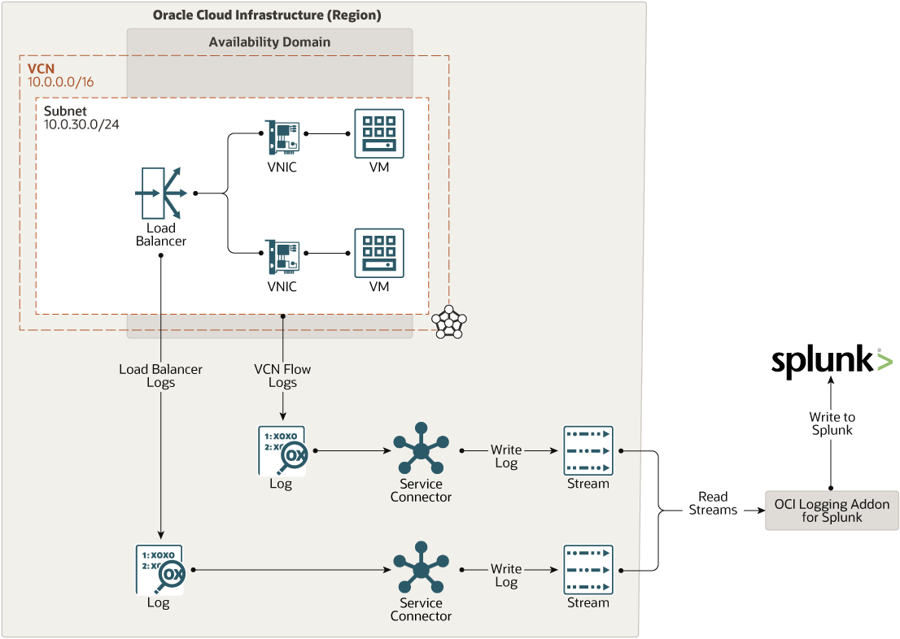

# terraform-oci-arch-logging-splunk

A security information and event management (SIEM) system is a critical operations tool to manage the security of your cloud resources. Oracle Cloud Infrastructure includes native threat detection, prevention, and response capabilities, which you can leverage to implement an efficient SIEM system using Splunk.

Splunk Enterprise administrators can use the Logging and Streaming services with the Logging Addon for Splunk, to stream logs from resources in the cloud to an existing or new Splunk environment. Administrators can also integrate with other Splunk plugins and data sources, such as threat intelligence feeds, to augment the generation of alerts based on log data.

## Reference Architecture

- [Implement a SIEM System in Splunk Using Logs Streamed from Oracle Cloud](https://docs.oracle.com/en/solutions/logs-stream-splunk/index.html)

## Prerequisites

- Permission to `manage` the following types of resources in your Oracle Cloud Infrastructure tenancy: `vcns`, `internet-gateways`, `route-tables`, `subnets`, `stream`, `stream-pull`, `stream-push`, and `instances`.

- Quota to create the following resources: 1 VCN, 2 subnets, 1 Internet Gateway, 1 NAT Gateway, 2 route rules, 2 stream/stream pool, 1 Log group, 3 Logs, 2 Service Connectors, 2 compute instances, 1 Load Balancer.

If you don't have the required permissions and quota, contact your tenancy administrator. See [Policy Reference](https://docs.cloud.oracle.com/en-us/iaas/Content/Identity/Reference/policyreference.htm), [Service Limits](https://docs.cloud.oracle.com/en-us/iaas/Content/General/Concepts/servicelimits.htm), [Compartment Quotas](https://docs.cloud.oracle.com/iaas/Content/General/Concepts/resourcequotas.htm).

## Deploy Using Oracle Resource Manager

1. Click [](https://cloud.oracle.com/resourcemanager/stacks/create?region=home&zipUrl=https://github.com/oracle-devrel/terraform-oci-arch-logging-splunk/releases/latest/download/terraform-oci-arch-logging-splunk-stack-latest.zip)

    If you aren't already signed in, when prompted, enter the tenancy and user credentials.

2. Review and accept the terms and conditions.

3. Select the region where you want to deploy the stack.

4. Follow the on-screen prompts and instructions to create the stack.

5. After creating the stack, click **Terraform Actions**, and select **Plan**.

6. Wait for the job to be completed, and review the plan.

    To make any changes, return to the Stack Details page, click **Edit Stack**, and make the required changes. Then, run the **Plan** action again.

7. If no further changes are necessary, return to the Stack Details page, click **Terraform Actions**, and select **Apply**. 

## Deploy Using the Terraform CLI

### Clone the Module
Now, you'll want a local copy of this repo. You can make that with the commands:

    git clone https://github.com/oracle-devrel/terraform-oci-arch-logging-splunk.git
    cd terraform-oci-arch-logging-splunk
    ls

### Set Up and Configure Terraform

1. Complete the prerequisites described [here](https://github.com/cloud-partners/oci-prerequisites).

2. Create a `terraform.tfvars` file, and specify the following variables:

```
# Authentication
tenancy_ocid         = "<tenancy_ocid>"
user_ocid            = "<user_ocid>"
fingerprint          = "<finger_print>"
private_key_path     = "<pem_private_key_path>"

# Region
region = "<oci_region>"

# Compartment
compartment_ocid = "<compartment_ocid>"

````

### Create the Resources
Run the following commands:

    terraform init
    terraform plan
    terraform apply

### Destroy the Deployment
When you no longer need the deployment, you can run this command to destroy the resources:

    terraform destroy

## Deploy as a Module
It's possible to utilize this repository as remote module, providing the necessary inputs:

```
module "oci-arch-logging-splunk" {
  source             = "github.com/oracle-devrel/terraform-oci-arch-logging-splunk"
  tenancy_ocid       = "<tenancy_ocid>"
  user_ocid          = "<user_ocid>"
  fingerprint        = "<user_ocid>"
  region             = "<oci_region>"
  private_key_path   = "<private_key_path>"
  compartment_ocid   = "<compartment_ocid>"
}
```

## Configure Splunk to access OCI Streams

### Download and Install the Plugin

`NOTE: Before proceeding with next steps, please open a service request with` [Oracle Support](https://support.oracle.com/portal/) `or ask your account team to reach out to virtual networking product management team to get the downloadable software of the plugin`

Perform the below steps to complete Step 4.

*	Download the plugin provided by Oracle support team.
*	From the Splunk Web home screen, click the `gear icon` next to `Apps`.
*	Click `Install app from file`.
*	Locate the downloaded plugin file and click `Upload`
*	If Splunk prompts you to restart, do so.
*	Verify that the plugin appears in the list of apps and add-ons by clicking Apps -> Manage Apps. You can also find it  on the server at `$SPLUNK_HOME/etc/apps/TA-oci-logging-addon`.

    

### Configure the Plugin

Perform the below steps complete Step 5.

*	On `splunk enterprise`, From the `Apps` menu, select `OCI Logging Addon`.

    

*	Click `OCI Connection Information`.

*   Either select to use Instance Principal (if you are using an OCI Instance). Alternatively, you can provide the connection information as shown below. 

    ```Note: To populate the Private Key field, open the pem file containing your OCI API signing key in your favorite text editor and paste the contents in that field.```

    

*	Next click Inputs, then the Create New Input button

    

*	Enter the configuration details from your OCI stream

    

    - `Name`: Friendly name choice
    - `Interval`: How often you want the plugin to attempt to check for new data
    - `Index`: Your Splunk index - recommended is `30 seconds`
    - `Stream ID`: The `OCID` of your OCI Stream
    - `Stream Endpoint`: For example, `https://cell-1.streaming.ap-chuncheon-1.oci.oraclecloud.com`
    - `OCI Region`: For example, `ap-chuncheon-1`
    - `Message Limit`: How many messages you want to retrieve with a single pull default - `10000`
    - Partition: the partition number on your stream - for a single partition stream this value is `0`

*   Click `Add`

    

This completes the configuration.

### Validate in Splunk

Now you can query your index and see data that looks similar to the below screenshot for validation.

   

### Implement a SIEM System in Splunk Using Logs Streamed from Oracle Cloud



## Contributing
This project is open source.  Please submit your contributions by forking this repository and submitting a pull request!  Oracle appreciates any contributions that are made by the open source community.

### Attribution & Credits
Initially, this project was created and distributed in [GitHub Oracle QuickStart space](https://github.com/oracle-quickstart/oci-arch-logging-splunk). For that reason, we would like to thank all the involved contributors enlisted below:
- Kartik Hegde (https://github.com/KartikShrikantHegde)

## License
Copyright (c) 2021 Oracle and/or its affiliates.

Licensed under the Universal Permissive License (UPL), Version 1.0.

See [LICENSE](LICENSE) for more details.
